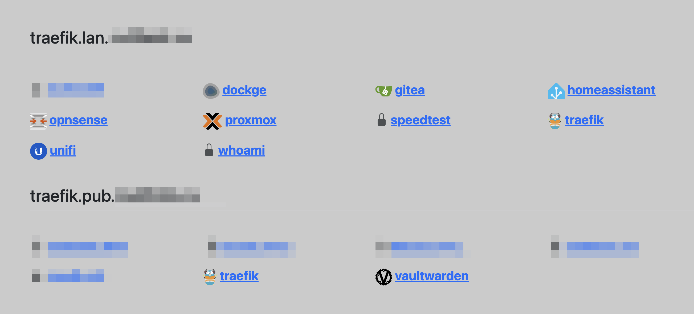

# Traefik app dashboard

Simple SvelteKit app to generate dashboard for your homelab traefik hosts

Limitation: only one Host rule per router, so if u need multiple hosts for same service - define multiple routers
```yml
- "traefik.http.routers.traefik1.rule=Host(`traefik1.lan`)"
- "traefik.http.routers.traefik2.rule=Host(`traefik2.lan`)"
```

`ENV TRAEFIK_API=`
accept comma-separated urls to api: 
`https://sometraefik.host/api/http/routers,http://127.0.0.1:8080/api/http/routers`

`ENV SHOW_HTTP=0`
by default non tls/https routes will be filtered out

Docker images:
https://hub.docker.com/r/buldezir/traefik-app-dashboard/tags



